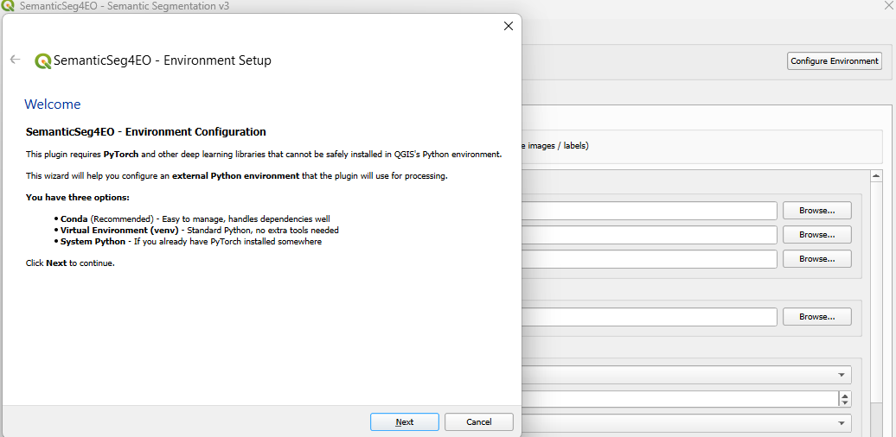
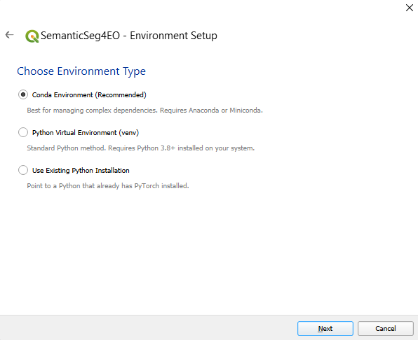
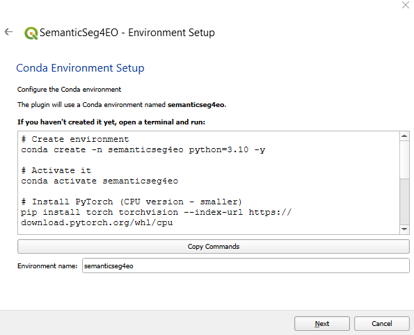
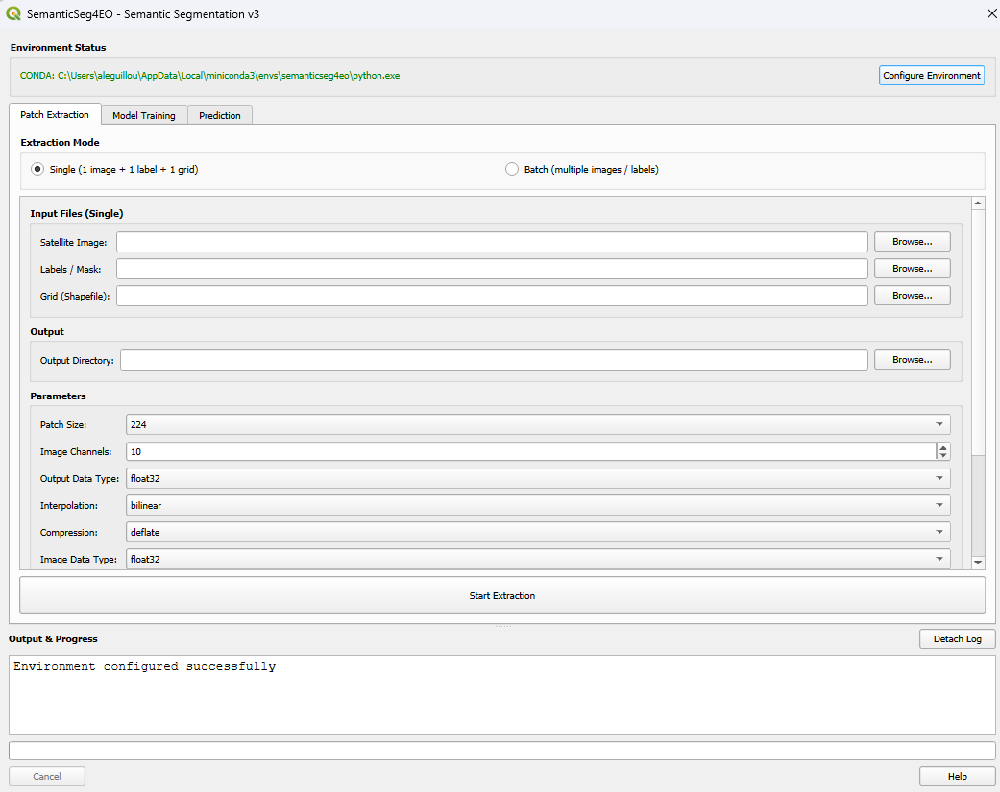

.. _environment_setup:

Environment Setup
=================

SemanticSeg4EO processes all satellite imagery in an **external Python environment**,
completely separate from QGIS. This page explains how to create and configure that environment.

.. contents:: On this page
   :local:
   :depth: 2

Why an External Environment?
-----------------------------

QGIS ships with its own modified Python environment containing specific versions of GDAL,
numpy, and PyQt5. Installing PyTorch and its heavy dependencies directly into QGIS often causes:

- GDAL/rasterio version conflicts
- Qt DLL conflicts (QGIS Qt vs PyTorch Qt on Windows)
- Crashes or broken QGIS on upgrade

The external environment approach means:

- QGIS stays stable and untouched
- You can freely manage GPU/CPU PyTorch versions
- Deep learning libraries are cleanly isolated

The Environment Setup Wizard
------------------------------

When you first open SemanticSeg4EO, the **environment status bar** at the top of the
dialog will show *"Not configured"*. Click **Configure Environment** to launch the wizard.

   *The environment status bar. Click "Configure Environment" to launch the wizard.*

.. .. [INSERT SCREENSHOT: Environment status bar — "Not configured"]

The wizard has six pages:

1. **Welcome** — Overview of the setup process
2. **Choose Environment Type** — Conda (recommended), venv, or existing Python
3. **Conda Setup** (if Conda chosen) — Environment name configuration
4. **venv Setup** (if venv chosen) — Path to the virtual environment folder
5. **System Python** (if existing Python chosen) — Path to the Python executable
6. **Verify Installation** — Runs a live check of the environment

   *Wizard step 2: choose Conda, venv, or existing Python.*

.. .. [INSERT SCREENSHOT: Wizard — environment type selection]

Option A: Conda *(Recommended)*
---------------------------------

Conda is the recommended approach because it handles complex binary dependencies
(GDAL, rasterio, PyTorch CUDA) better than pip alone.

.. rubric:: Step 1: Install Miniconda or Anaconda

If you do not have Conda installed, download and install
`Miniconda <https://docs.conda.io/en/latest/miniconda.html>`_
(lightweight) or `Anaconda <https://www.anaconda.com/>`_ (full distribution).

.. rubric:: Step 2: Create the environment

Open a terminal (Anaconda Prompt on Windows, or a regular terminal on Linux/macOS):

.. code-block:: bash

   conda create -n semanticseg4eo python=3.10 -y
   conda activate semanticseg4eo

.. rubric:: Step 3: Install PyTorch

Choose the command that matches your hardware:

**CPU only** (works everywhere, no GPU required):

.. code-block:: bash

   pip install torch torchvision --index-url https://download.pytorch.org/whl/cpu

**GPU with CUDA 11.8** (for NVIDIA GPUs, RTX 2000/3000 series):

.. code-block:: bash

   pip install torch torchvision --index-url https://download.pytorch.org/whl/cu118

**GPU with CUDA 12.1** (for NVIDIA GPUs, RTX 4000 series and newer):

.. code-block:: bash

   pip install torch torchvision --index-url https://download.pytorch.org/whl/cu121

.. tip::
   To find your CUDA version, run ``nvidia-smi`` in a terminal. The CUDA version is
   shown in the top-right corner.

.. rubric:: Step 4: Install the other dependencies

.. code-block:: bash

   # Core geospatial and image I/O
   pip install rasterio tifffile geopandas opencv-python

   # Segmentation model library (strongly recommended)
   pip install segmentation-models-pytorch

   # General utilities
   pip install numpy scipy scikit-learn matplotlib tqdm imagecodecs

   # Optional: modern architectures (SegFormer, HRNet, SwinUNet)
   pip install transformers timm

Or install everything at once using the ``requirements_external.txt`` file from the
plugin folder:

.. code-block:: bash

   pip install -r /path/to/plugin/requirements_external.txt

.. note::
   The ``requirements_external.txt`` file does **not** include PyTorch because the
   correct index URL depends on your GPU. Always install PyTorch first (Step 3),
   then run the requirements file.

.. rubric:: Step 5: Configure in the wizard

Back in QGIS, in the wizard's **Conda Setup** page:

- Leave the environment name as ``semanticseg4eo`` (or type the name you used)
- Click **Verify Environment** on the last page to confirm everything works

   *Wizard step 3: Conda environment name.*

.. .. [INSERT SCREENSHOT: Wizard — Conda page with env name field]

The wizard automatically searches for the Conda Python executable in these locations:

- ``~/miniconda3/envs/<env_name>/`` (Linux/macOS)
- ``~/anaconda3/envs/<env_name>/`` (Linux/macOS)
- ``/opt/conda/envs/<env_name>/`` (Linux/macOS)
- ``%USERPROFILE%\miniconda3\envs\<env_name>\`` (Windows)
- ``%USERPROFILE%\anaconda3\envs\<env_name>\`` (Windows)
- ``%USERPROFILE%\AppData\Local\miniconda3\envs\<env_name>\`` (Windows)

Option B: Python Virtual Environment (venv)
--------------------------------------------

Use this option if you prefer not to install Conda.

.. rubric:: Windows

.. code-block:: bat

   python -m venv C:\semanticseg4eo_env
   C:\semanticseg4eo_env\Scripts\activate

   pip install torch torchvision --index-url https://download.pytorch.org/whl/cpu
   pip install rasterio tifffile geopandas opencv-python
   pip install segmentation-models-pytorch numpy scipy scikit-learn matplotlib tqdm
   pip install transformers timm

.. rubric:: Linux / macOS

.. code-block:: bash

   python3 -m venv ~/semanticseg4eo_env
   source ~/semanticseg4eo_env/bin/activate

   pip install torch torchvision --index-url https://download.pytorch.org/whl/cpu
   pip install rasterio tifffile geopandas opencv-python
   pip install segmentation-models-pytorch numpy scipy scikit-learn matplotlib tqdm
   pip install transformers timm

In the wizard's **venv Setup** page, browse to the root of the virtual environment folder
(e.g., ``C:\semanticseg4eo_env`` or ``~/semanticseg4eo_env``). The plugin will
automatically locate the ``python.exe`` (Windows) or ``bin/python`` (Linux/macOS) inside.

Option C: Existing Python Installation
----------------------------------------

If you already have a Python installation with PyTorch available, choose
**"Use Existing Python Installation"** in the wizard. Browse to the Python
executable directly (e.g., ``/usr/bin/python3`` or a path inside an existing env).

.. warning::
   The existing Python must have **all** required packages installed. Use the
   **Verify Environment** step to confirm.

Verifying the Environment
--------------------------

On the wizard's last page, click **Verify Environment**. The wizard will:

1. Locate the Python executable
2. Check the Python version
3. Import and report the version of each required package

   *Verification page: green ticks for installed packages.*

.. .. [INSERT SCREENSHOT: Wizard — Verify page with package list]

A successful verification looks like:

.. code-block:: text

   Python path: /home/user/miniconda3/envs/semanticseg4eo/bin/python
   Python executable found
   Python 3.10.12
   ✓ torch 2.1.0+cu118
   ✓ torchvision 0.16.0+cu118
   ✓ rasterio 1.3.8
   ✓ geopandas 0.14.0
   ✓ cv2 4.8.0
   ✓ segmentation_models_pytorch 0.3.3
   ✓ transformers 4.36.0
   ✓ timm 0.9.10
   ✓ sklearn 1.3.2
   ✓ tqdm 4.66.1
   Environment is ready!

Once verified, click **Finish** in the wizard. The environment status bar will
update to show your environment type and Python path.

.. figure:: ../_images/env_status_configured.png
   :alt: Configured environment status
   :align: center
   :width: 80%

   *Status bar after successful configuration.*

.. .. [INSERT SCREENSHOT: Status bar — "Conda: semanticseg4eo | Python: /home/..."]

Environment Configuration File
--------------------------------

The plugin stores the environment path in a ``config.json`` file located inside
the plugin folder. You can inspect or manually edit it if needed:

.. code-block:: json

   {
     "python_path": "/home/user/miniconda3/envs/semanticseg4eo/bin/python",
     "env_type": "conda",
     "conda_env_name": "semanticseg4eo",
     "venv_path": "",
     "last_check": "",
     "dependencies_ok": true
   }

To reconfigure the environment at any time, click **Configure Environment** in the
status bar from the main plugin dialog.

How the Environment Isolation Works
-------------------------------------

When SemanticSeg4EO launches a processing script, it:

1. Creates a **clean copy** of the system environment
2. Removes all QGIS-related variables (``PYTHONHOME``, ``PYTHONPATH``,
   ``QT_PLUGIN_PATH``, ``QGIS_PREFIX_PATH``, etc.)
3. On Windows, filters QGIS/OSGeo4W paths from ``PATH`` to prevent Qt DLL conflicts
4. Sets the conda environment's own ``GDAL_DATA`` and ``PROJ_LIB``
5. Forces ``PYTHONUTF8=1`` to handle paths with special characters (é, è, ê, etc.)

This guarantees that PyTorch and rasterio run in a fully isolated environment,
with no interference from QGIS libraries.
