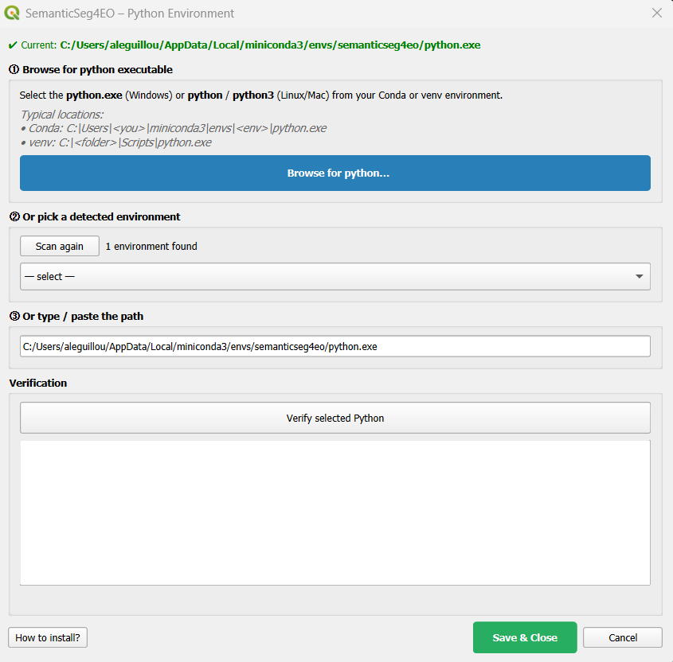
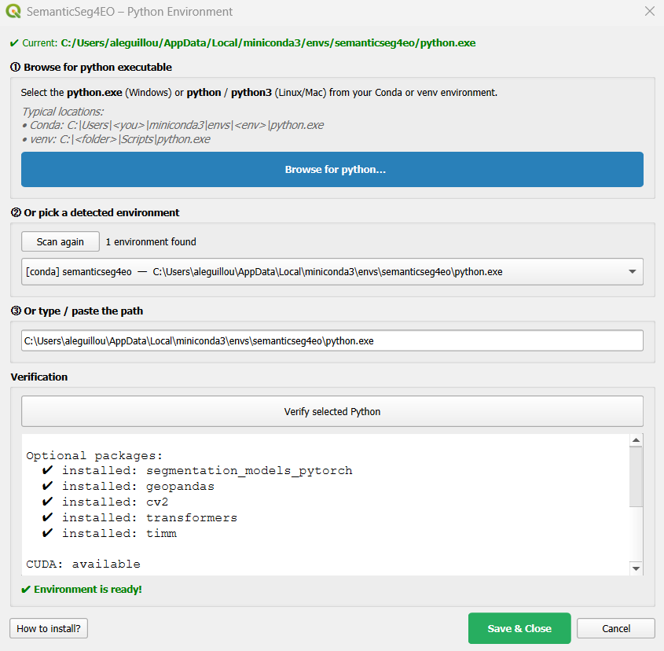
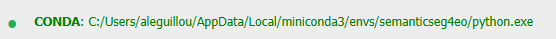

.. _environment_setup:

Environment Setup
=================

SemanticSeg4EO processes all satellite imagery in an **external Python environment**,
completely separate from QGIS. This page explains how to create and configure that
environment.

.. contents:: On this page
   :local:
   :depth: 2

Why an External Environment?
-----------------------------

QGIS ships with its own modified Python environment containing specific versions of
GDAL, numpy, and PyQt5. Installing PyTorch and its heavy dependencies directly into
QGIS often causes:

- GDAL/rasterio version conflicts
- Qt DLL conflicts (QGIS Qt vs PyTorch Qt on Windows)
- Crashes or broken QGIS on upgrade

The external environment approach means:

- QGIS stays stable and untouched
- You can freely manage GPU/CPU PyTorch versions
- Deep learning libraries are cleanly isolated

Configuring the Plugin
-----------------------

When you first open SemanticSeg4EO, the **environment status bar** at the top of
the dialog will show *"No Python environment configured"*.

   *The environment status bar before configuration.*

You have two ways to point the plugin to your Python executable:

Quick method: Browse directly
~~~~~~~~~~~~~~~~~~~~~~~~~~~~~~

Click **Browse python…** in the status bar. A file dialog opens — navigate to the
``python.exe`` (Windows) or ``python`` / ``python3`` (Linux/macOS) inside your
Conda or venv environment, select it, and you are done.

Typical locations:

- **Conda (Windows):** ``C:\Users\<you>\miniconda3\envs\<env>\python.exe``
- **Conda (Linux/macOS):** ``~/miniconda3/envs/<env>/bin/python``
- **venv (Windows):** ``C:\<folder>\Scripts\python.exe``
- **venv (Linux/macOS):** ``~/<folder>/bin/python``

Full configuration dialog
~~~~~~~~~~~~~~~~~~~~~~~~~~~

Click **Configure Environment** to open the configuration dialog. It provides three
options on a single screen:

1. **Browse for python** — same file dialog as above, with a prominent button and
   path hints.
2. **Pick a detected environment** — the dialog automatically scans your system for
   Conda environments (Miniconda, Anaconda, Miniforge, Mambaforge) and virtual
   environments in common locations. All detected environments appear in a dropdown
   list; select one and it is applied.
3. **Type or paste a path** — enter the full path to the Python executable manually.

   *The environment configuration dialog. Browse, pick from the list, or type the path.*

Once you have selected a path, click **Verify selected Python** to run a live check,
then **Save & Close**. The status bar will update to show the active environment.

Creating the External Environment
-----------------------------------

If you do not have a suitable Python environment yet, follow one of the options
below.

Option A: Conda *(Recommended)*
~~~~~~~~~~~~~~~~~~~~~~~~~~~~~~~~~

Conda handles complex binary dependencies (GDAL, rasterio, PyTorch CUDA) better than
pip alone.

.. rubric:: Step 1 — Install Miniconda or Anaconda

If you do not have Conda installed, download and install
`Miniconda <https://docs.conda.io/en/latest/miniconda.html>`_
(lightweight) or `Anaconda <https://www.anaconda.com/>`_ (full distribution).

.. rubric:: Step 2 — Create the environment

Open a terminal (Anaconda Prompt on Windows):

.. code-block:: bash

   conda create -n semanticseg4eo python=3.10 -y
   conda activate semanticseg4eo

.. rubric:: Step 3 — Install PyTorch

Choose the command that matches your hardware:

**CPU only** (works everywhere, no GPU required):

.. code-block:: bash

   pip install torch torchvision --index-url https://download.pytorch.org/whl/cpu

**GPU — CUDA 11.8** (NVIDIA RTX 2000/3000 series):

.. code-block:: bash

   pip install torch torchvision --index-url https://download.pytorch.org/whl/cu118

**GPU — CUDA 12.1** (NVIDIA RTX 4000 series and newer):

.. code-block:: bash

   pip install torch torchvision --index-url https://download.pytorch.org/whl/cu121

**GPU — CUDA 12.4**:

.. code-block:: bash

   pip install torch torchvision --index-url https://download.pytorch.org/whl/cu124

.. tip::
   To find your CUDA version, run ``nvidia-smi`` in a terminal. The CUDA version
   is shown in the top-right corner.

.. rubric:: Step 4 — Install the remaining dependencies

.. code-block:: bash

   pip install -r requirements_external.txt

Or manually:

.. code-block:: bash

   # Core geospatial and image I/O
   pip install "numpy>=1.21,<2" rasterio tifffile imagecodecs geopandas opencv-python

   # Segmentation model library (recommended)
   pip install segmentation-models-pytorch

   # Utilities
   pip install scipy scikit-learn matplotlib tqdm

   # Optional: modern architectures (SegFormer, HRNet, SwinUNet, ConvNeXt)
   pip install transformers timm

.. important::
   Always install PyTorch **before** the other packages. The
   ``requirements_external.txt`` file does not include PyTorch because the correct
   index URL depends on your hardware.

.. important::
   The ``numpy<2`` constraint is required. NumPy 2.x breaks the binary interface of
   rasterio, OpenCV, and older PyTorch builds.

Option B: Python Virtual Environment (venv)
~~~~~~~~~~~~~~~~~~~~~~~~~~~~~~~~~~~~~~~~~~~~~

Use this option if you prefer not to install Conda.

.. rubric:: Windows

.. code-block:: bat

   python -m venv C:\semanticseg4eo_env
   C:\semanticseg4eo_env\Scripts\activate

   pip install torch torchvision --index-url https://download.pytorch.org/whl/cpu
   pip install -r requirements_external.txt

.. rubric:: Linux / macOS

.. code-block:: bash

   python3 -m venv ~/semanticseg4eo_env
   source ~/semanticseg4eo_env/bin/activate

   pip install torch torchvision --index-url https://download.pytorch.org/whl/cpu
   pip install -r requirements_external.txt

Dependency Reference
----------------------

The table below lists all dependencies expected by the external scripts.

.. list-table::
   :header-rows: 1
   :widths: 30 15 55

   * - Package
     - Required?
     - Used by
   * - ``torch`` / ``torchvision``
     - **Yes**
     - Model training and prediction
   * - ``numpy`` (< 2.0)
     - **Yes**
     - Array operations (all scripts)
   * - ``rasterio``
     - **Yes**
     - Reading/writing GeoTIFFs, georeferencing
   * - ``tifffile`` / ``imagecodecs``
     - **Yes**
     - Reading compressed TIFF patches during training
   * - ``geopandas``
     - **Yes**
     - Reading grid shapefiles (patch extraction)
   * - ``opencv-python``
     - **Yes**
     - Image resizing / interpolation (patch extraction)
   * - ``scipy``
     - **Yes**
     - Gaussian filters (augmentation), confidence intervals (k-fold)
   * - ``scikit-learn``
     - **Yes**
     - K-Fold cross-validation, class weight computation
   * - ``matplotlib``
     - **Yes**
     - Training plots, patch visualisation
   * - ``tqdm``
     - **Yes**
     - Progress bars
   * - ``segmentation-models-pytorch``
     - Recommended
     - U-Net, U-Net++, DeepLabV3+, FPN, PSPNet, MAnet, PAN, LinkNet
   * - ``transformers``
     - Optional
     - SegFormer architectures
   * - ``timm``
     - Optional
     - HRNet, SwinUNet, ConvNeXt encoders

Verifying the Environment
---------------------------

In the configuration dialog, click **Verify selected Python**. The plugin will:

1. Run the selected Python executable
2. Check the Python version
3. Import each required and optional package and report its version

A successful verification looks like:

.. code-block:: text

   Python: C:\Users\user\miniconda3\envs\semanticseg4eo\python.exe
   Python 3.10.12

   Required packages:
     ✔ torch: 2.1.0+cu118
     ✔ numpy: 1.26.4
     ✔ rasterio: 1.3.10
     ✔ tifffile: 2024.2.12

   Optional packages:
     ✔ installed: segmentation_models_pytorch
     ✔ installed: geopandas
     ✔ installed: cv2
     ✔ installed: transformers
     ✔ installed: timm

   CUDA: available

   ✔ Environment is ready!

   *Verification output inside the configuration dialog.*

After verification, click **Save & Close**. The status bar updates to show
the environment type and Python path in green.

   *Status bar after successful configuration.*

Environment Configuration File
---------------------------------

The plugin stores the environment path in a ``config.json`` file located inside
the plugin folder. You can inspect or manually edit it if needed:

.. code-block:: json

   {
     "python_path": "C:/Users/user/miniconda3/envs/semanticseg4eo/python.exe",
     "env_type": "conda",
     "conda_env_name": "semanticseg4eo",
     "venv_path": "",
     "last_check": "",
     "dependencies_ok": true
   }

To reconfigure the environment at any time, click **Browse python…** or
**Configure Environment** in the status bar.

How the Environment Isolation Works
--------------------------------------

When SemanticSeg4EO launches a processing script, it:

1. Creates a **clean copy** of the system environment
2. Removes all QGIS-related variables (``PYTHONHOME``, ``PYTHONPATH``,
   ``QT_PLUGIN_PATH``, ``QGIS_PREFIX_PATH``, etc.)
3. On Windows, filters QGIS/OSGeo4W paths from ``PATH`` to prevent Qt DLL conflicts
4. Sets the conda environment's own ``GDAL_DATA`` and ``PROJ_LIB``
5. Forces ``PYTHONUTF8=1`` to handle paths with special characters (e.g. accented
   letters)

This guarantees that PyTorch and rasterio run in a fully isolated environment,
with no interference from QGIS libraries.
