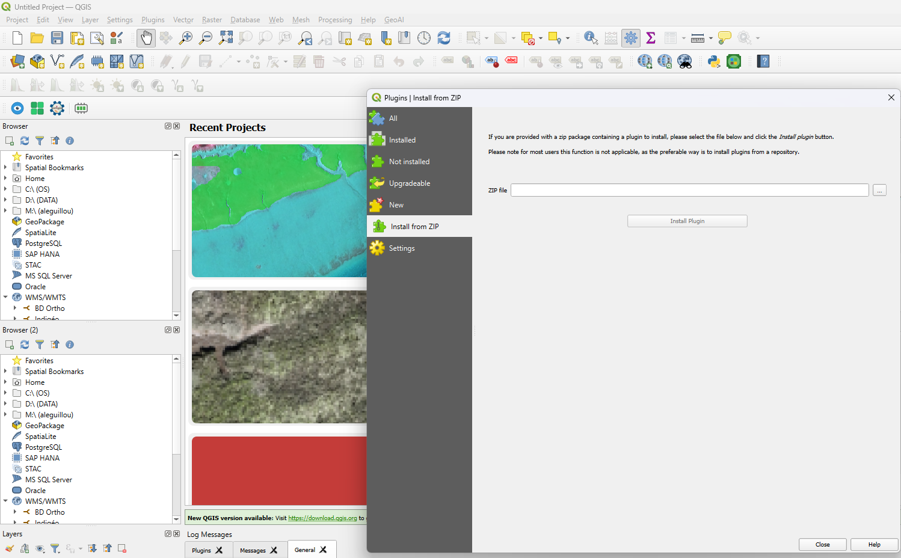

.. _installation:

Installation
============

Requirements
------------

**QGIS side (no special requirements):**

- QGIS 3.16 or later
- No additional Python packages are required inside QGIS

**External Python environment (installed separately — see** :doc:`environment_setup` **):**

- Python 3.8+
- PyTorch 1.10+
- rasterio ≥ 1.2.0
- geopandas ≥ 0.10.0
- opencv-python ≥ 4.5.0
- segmentation-models-pytorch ≥ 0.3.0 *(optional but strongly recommended)*
- numpy, scipy, scikit-learn, matplotlib, tqdm
- transformers, timm *(optional — required for SegFormer, HRNet, SwinUNet)*

.. important::

   SemanticSeg4EO does **not** install PyTorch or any deep learning library into QGIS.
   All processing runs in a separate Python environment that you configure once.
   This keeps your QGIS installation stable and free of dependency conflicts.

Step 1 — Install the QGIS Plugin
---------------------------------

1. Download ``SemanticSeg4EO.zip`` from the
   `GitHub releases page <https://github.com/aleguillou1/SemanticSeg4EO_Qgis/tree/main/Plug-in>`_.

2. In QGIS, open **Plugins → Manage and Install Plugins**.

3. Click the **Install from ZIP** tab.

4. Browse to the downloaded ``SemanticSeg4EO.zip`` file and click **Install Plugin**.

5. Once installed, go to the **Installed** tab, find *SemanticSeg4EO*, and make sure the
   checkbox is ticked to enable it.

   *Installing the plugin from a ZIP file in QGIS.*

.. .. [INSERT SCREENSHOT: QGIS Plugin Manager — Install from ZIP]

After enabling the plugin, you will see a new **SemanticSeg4EO** entry in:

- The **Raster** menu
- The QGIS toolbar (icon |icon|)

.. |icon| image:: ../_images/icon_small.png
   :height: 20px

.. .. [INSERT ICON IMAGE]

Step 2 — Create the External Python Environment
------------------------------------------------

After installing the plugin, you must create the external Python environment
before any processing can happen. Proceed to :doc:`environment_setup`.

Updating the Plugin
-------------------

To update SemanticSeg4EO:

1. Download the new ``SemanticSeg4EO.zip`` from GitHub.
2. In QGIS, go to **Plugins → Manage and Install Plugins → Installed**.
3. Uninstall the existing version, then repeat the ZIP installation steps above.

.. note::
   Your ``config.json`` (environment path) is stored inside the plugin folder.
   After an update, you may need to re-run the Environment Setup Wizard once.

Uninstalling
------------

1. In QGIS: **Plugins → Manage and Install Plugins → Installed**
2. Select *SemanticSeg4EO* and click **Uninstall Plugin**
3. Optionally, delete the external Conda/venv environment you created.
