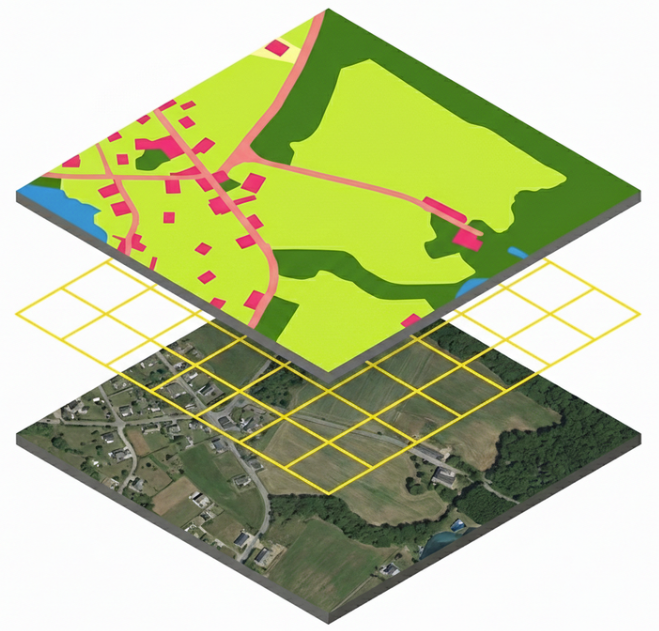
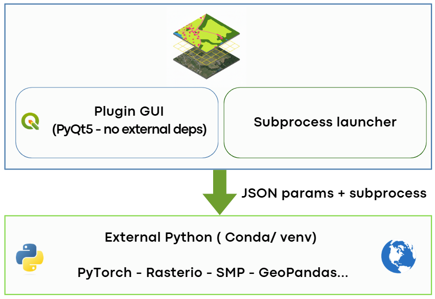

.. SemanticSeg4EO documentation master file

SemanticSeg4EO — QGIS Plugin Documentation
===========================================

**SemanticSeg4EO** is a QGIS plugin for semantic segmentation of satellite and aerial imagery
using deep learning — all from within QGIS, without breaking your QGIS Python environment.

.. admonition:: Key Design Principle

   SemanticSeg4EO uses an **external Python environment** (Conda or venv) for all heavy processing.
   PyTorch, rasterio, and other dependencies are **never** loaded into QGIS itself, keeping your
   installation stable and conflict-free.

.. grid:: 2

   .. grid-item-card:: 🚀 Getting Started
      :link: getting_started/index
      :link-type: doc

      Install the plugin and configure your environment in a few steps.

   .. grid-item-card:: 📋 User Guide
      :link: user_guide/index
      :link-type: doc

      Learn how to extract patches, train models, and run predictions.

.. toctree::
   :maxdepth: 2
   :caption: Getting Started
   :hidden:

   getting_started/index
   getting_started/installation
   getting_started/environment_setup
   getting_started/first_steps

.. toctree::
   :maxdepth: 3
   :caption: User Guide
   :hidden:

   user_guide/index
   user_guide/patch_extraction
   user_guide/model_training
   user_guide/prediction

.. toctree::
   :maxdepth: 2
   :caption: Reference
   :hidden:

   reference/architectures
   reference/loss_functions
   reference/augmentation
   reference/parameters

.. toctree::
   :maxdepth: 1
   :caption: Help & Troubleshooting
   :hidden:

   reference/troubleshooting
   reference/faq
   reference/changelog

Overview
--------

SemanticSeg4EO is designed for Earth Observation (EO) professionals who need to:

- Extract training patches from large satellite GeoTIFFs
- Train state-of-the-art deep learning segmentation models
- Apply trained models to new large images with seamless reconstruction

All processing happens in a clean external Python environment, communicating with QGIS
via temporary JSON and subprocess calls.

   *Plugin architecture: QGIS GUI talks to an external Python environment via subprocess.*

.. .. [INSERT ARCHITECTURE DIAGRAM HERE]

Features at a Glance
---------------------

.. list-table::
   :widths: 30 70
   :header-rows: 1

   * - Module
     - Features
   * - **Patch Extraction**
     - Single & batch mode, georeferenced GeoTIFF output, CRS validation,
       configurable train/val/test split, custom file naming patterns
   * - **Model Training**
     - 20+ architectures, 5 augmentation levels, 15+ loss functions,
       AMP mixed precision, K-Fold cross-validation, early stopping
   * - **Prediction**
     - Large image tiling, Gaussian blending, batch inference,
       confidence map output, auto-load result in QGIS

Supported Architectures
-----------------------

+-----------------------------+--------------------------------------------------+
| Category                    | Architectures                                    |
+=============================+==================================================+
| Built-in (no deps)          | ``unet-dropout``                                 |
+-----------------------------+--------------------------------------------------+
| SMP (segmentation-models)   | ``unet``, ``unet++``, ``manet``, ``linknet``,    |
|                             | ``fpn``, ``pspnet``, ``pan``,                    |
|                             | ``deeplabv3``, ``deeplabv3+``                    |
+-----------------------------+--------------------------------------------------+
| Transformer (modern)        | ``segformer-b0`` → ``b5``, ``unetformer``,       |
|                             | ``hrnet-w18/w32/w48``, ``swin-unet``             |
+-----------------------------+--------------------------------------------------+

Quick Links
-----------

- :doc:`getting_started/environment_setup` — Set up your Conda or venv environment
- :doc:`user_guide/patch_extraction` — Extract training patches from large images
- :doc:`user_guide/model_training` — Configure and launch model training
- :doc:`user_guide/prediction` — Apply your model to new imagery
- :doc:`reference/troubleshooting` — Common errors and fixes
