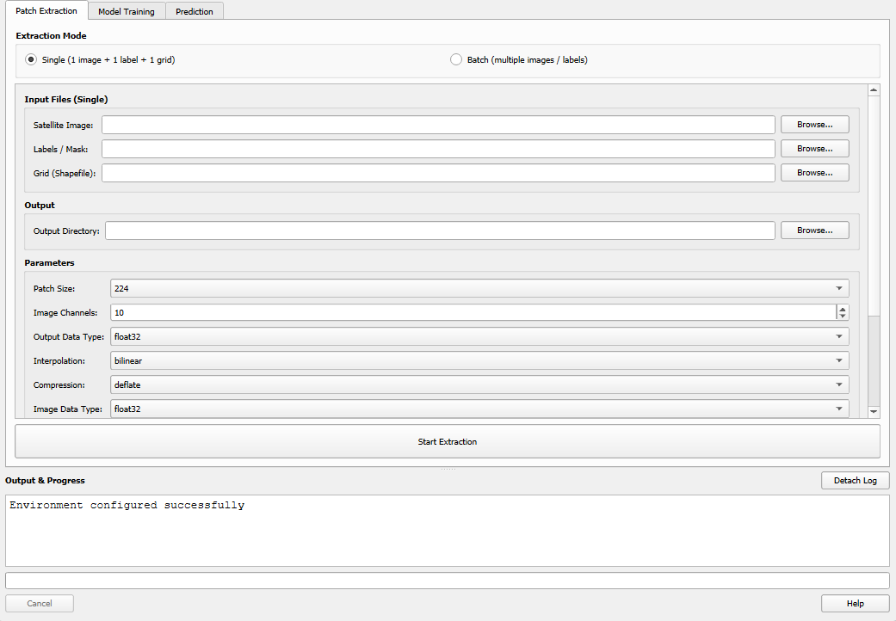
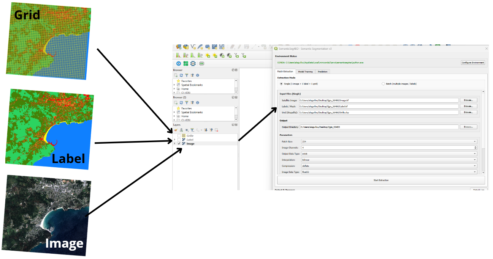
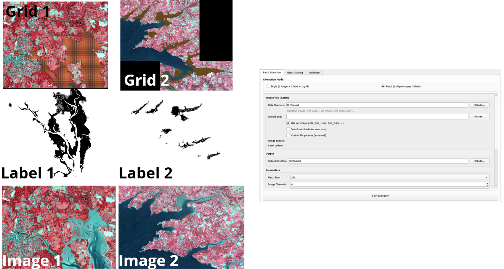
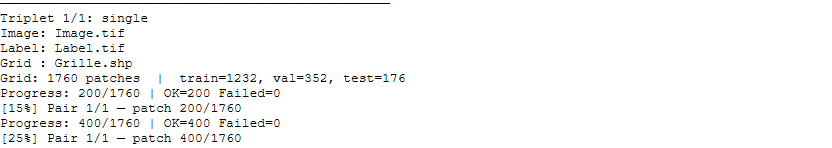

.. _patch_extraction:

Patch Extraction
================

The **Patch Extraction** tab slices large satellite GeoTIFFs into fixed-size
georeferenced patches suitable for deep learning training. It supports both
single-image and batch extraction modes.

   *The Patch Extraction tab.*

.. .. [INSERT SCREENSHOT: Patch Extraction tab — full view]

.. contents:: On this page
   :local:
   :depth: 2

Extraction Modes
-----------------

Two modes are available via radio buttons at the top of the tab:

- **Single Mode**: Extract patches from one image + one label + one grid
- **Batch Mode**: Extract from multiple image/label pairs at once

Click the appropriate radio button — the input fields will switch accordingly.

Single Mode
~~~~~~~~~~~~

Use single mode for straightforward one-off extractions.

   *Single mode: one image, one label, one grid.*

.. .. [INSERT SCREENSHOT: Single mode input group]

**Required inputs:**

.. list-table::
   :widths: 25 75
   :header-rows: 1

   * - Field
     - Description
   * - **Satellite Image**
     - Path to a multi-band georeferenced GeoTIFF (e.g., Sentinel-2)
   * - **Labels / Mask**
     - Path to a single-band GeoTIFF with integer class values
   * - **Grid (Shapefile)**
     - Path to a ``.shp`` polygon grid defining patch locations
   * - **Output Directory**
     - Folder where extracted patches will be saved

Batch Mode
~~~~~~~~~~~

Use batch mode to process multiple image/label pairs in one operation.
This is particularly useful when working with large mosaicked datasets or
multi-date time series.

   *Batch mode: data directory + optional shared grid.*

.. .. [INSERT SCREENSHOT: Batch mode input group]

**Required inputs:**

.. list-table::
   :widths: 25 75
   :header-rows: 1

   * - Field
     - Description
   * - **Data Directory**
     - Folder containing all your image and label files
   * - **Shared Grid**
     - A single ``.shp`` polygon grid applied to all image pairs
       *(not required if per-image grids are enabled)*
   * - **Output Directory**
     - Folder where extracted patches will be saved

**File Naming Convention**

By default, batch mode expects files named following this convention:

.. code-block:: text

   Image_1.tif,  Label_1.tif
   Image_2.tif,  Label_2.tif
   Image_3.tif,  Label_3.tif
   ...

The matching is case-insensitive. Files are paired by the numeric index (``1``, ``2``, etc.).

**Per-image Grids (optional)**

Check **"Use per-image grids"** to use a different grid for each image pair.
Per-image grid files must follow the naming pattern ``Grid_N.shp``
(where ``N`` matches the image/label index):

.. code-block:: text

   data_folder/
   ├── Image_1.tif
   ├── Label_1.tif
   ├── Grid_1.shp        ← grid for pair 1
   ├── Image_2.tif
   ├── Label_2.tif
   ├── Grid_2.shp        ← grid for pair 2

If a per-image grid is not found for a given pair, the shared grid is used as a fallback.

**Custom File Patterns (Advanced)**

If your files do not follow the default ``Image_N`` / ``Label_N`` naming, you can
define custom regex patterns by expanding the **Advanced Options** section:

.. list-table::
   :widths: 25 25 50
   :header-rows: 1

   * - Field
     - Default Regex
     - Example match
   * - **Image Pattern**
     - ``image_(\d+)``
     - ``image_42.tif`` → index ``42``
   * - **Label Pattern**
     - ``label_(\d+)``
     - ``label_42.tif`` → index ``42``

The capture group ``(\d+)`` must capture the index used to pair images and labels.
The match is case-insensitive.

**Batch Output Naming**

Batch mode adds an ``img1_``, ``img2_`` ... prefix to all patch filenames to avoid
collisions when multiple pairs produce the same patch indices.

.. code-block:: text

   output_dir/
   ├── train/
   │   ├── img1_patch_0001_image.tif
   │   ├── img1_patch_0001_label.tif
   │   ├── img2_patch_0001_image.tif
   │   ├── img2_patch_0001_label.tif
   │   └── ...
   ├── val/
   │   └── ...
   └── test/
       └── ...

Extraction Parameters
----------------------

These parameters appear in the **Parameters** group and apply to both single and batch mode.

.. list-table::
   :widths: 25 15 60
   :header-rows: 1

   * - Parameter
     - Default
     - Description
   * - **Patch Size** (px)
     - 256
     - Width and height of each output patch in pixels.
       Common values: 224, 256, 512.
   * - **Image Channels**
     - 4
     - Number of bands in the satellite image.
       This is used for validation — it does not resample the image.
   * - **Interpolation**
     - bilinear
     - Resampling method for the image patches.
       Labels always use **nearest-neighbor** regardless of this setting.
       Options: ``bilinear``, ``nearest``, ``bicubic``, ``lanczos``.
   * - **Compression**
     - deflate
     - Compression codec for output GeoTIFFs.
       Options: ``deflate``, ``lzw``, ``none``.
   * - **Validate CRS**
     - checked
     - Warn if the image, label, and grid have different coordinate reference systems.
       Processing continues but results may be incorrect if CRS mismatches exist.
   * - **ID Column**
     - ``id``
     - Column in the grid shapefile used to name output patches.
       If the column does not exist, sequential numbering is used.
   * - **Train Ratio**
     - 0.70
     - Fraction of patches assigned to the training split (0.0–1.0).
   * - **Val Ratio**
     - 0.20
     - Fraction assigned to validation. Must sum to 1.0 together with
       Train Ratio + Test Ratio.
   * - **Test Ratio**
     - 0.10
     - Fraction assigned to the test split.

.. note::
   The three ratio values must sum to ``1.0 ± 0.05``. A running total is displayed
   next to the ratio fields. If the sum is out of range, extraction will not start.

Output Structure
-----------------

All extracted patches are georeferenced GeoTIFFs organized in train/val/test subfolders:

.. code-block:: text

   output_dir/
   ├── train/
   │   ├── patch_0001_image.tif
   │   ├── patch_0001_label.tif
   │   ├── patch_0002_image.tif
   │   ├── patch_0002_label.tif
   │   └── ...
   ├── val/
   │   ├── patch_0012_image.tif
   │   ├── patch_0012_label.tif
   │   └── ...
   └── test/
       ├── patch_0045_image.tif
       ├── patch_0045_label.tif
       └── ...

Each patch is a **georeferenced GeoTIFF** that can be loaded directly in QGIS for
visual inspection.

After batch extraction, per-pair statistics are reported in the output log:

.. code-block:: text

   Pair img1 (Image_1.tif): 120 patches → 84 train, 24 val, 12 test
   Pair img2 (Image_2.tif): 95 patches → 66 train, 19 val, 10 test
   Total: 215 patches

Running Extraction
-------------------

1. Select your mode (Single or Batch) and fill in all required fields.
2. Set the train/val/test ratios (they must sum to 1.0).
3. Click **Start Extraction**.

The progress bar and log will update in real time. Large images or many pairs
may take several minutes depending on patch count and disk speed.

   *Extraction in progress: live log and progress bar.*

.. .. [INSERT SCREENSHOT: Extraction running — log with progress bar]

CRS Validation
---------------

If **Validate CRS** is checked and the image, label, or grid have different
coordinate reference systems, a warning is written to the log:

.. code-block:: text

   WARNING: CRS mismatch!
     Image CRS:  EPSG:32631
     Label CRS:  EPSG:4326
     Grid CRS:   EPSG:32631

Extraction will still proceed, but the results may be spatially misaligned.
To fix this, reproject all inputs to a common CRS before extracting:

- **QGIS**: use **Raster → Projections → Warp (Reproject)**
- **gdalwarp** (command line): ``gdalwarp -t_srs EPSG:32631 label.tif label_reprojected.tif``
