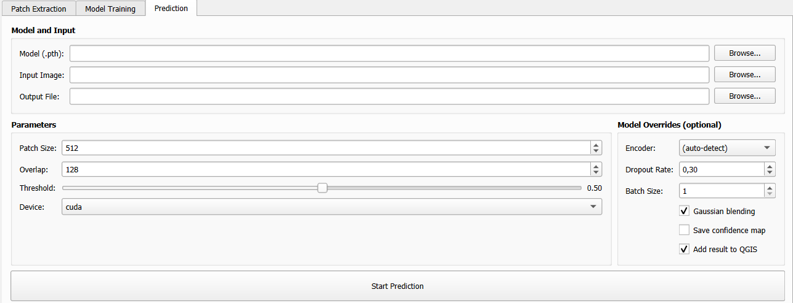

.. _prediction:

Prediction
==========

The **Prediction** tab applies a trained model to a new large satellite image,
producing a georeferenced segmentation map as a GeoTIFF.

   *The Prediction tab.*

.. .. [INSERT SCREENSHOT: Prediction tab — full view]

.. contents:: On this page
   :local:
   :depth: 2

How Prediction Works
---------------------

Because satellite images are too large to feed directly to a neural network,
the prediction engine uses a **sliding window** approach:

1. The input image is divided into overlapping patches of size ``Patch Size``
2. Each patch is run through the model
3. Predictions are blended back together using **Gaussian weighting** (optional)
   to produce a seamless full-resolution output

.. figure:: ../_images/prediction_sliding_window.png
   :alt: Sliding window diagram
   :align: center
   :width: 70%

   *Sliding window prediction with overlapping patches.*

.. .. [INSERT DIAGRAM: sliding window with overlap and Gaussian blending]

Model and Input Files
----------------------

.. list-table::
   :widths: 25 75
   :header-rows: 1

   * - Field
     - Description
   * - **Model (.pth)**
     - Path to the trained model checkpoint (``.pth`` file) produced by the
       Model Training step.
   * - **Input Image**
     - Path to the satellite GeoTIFF to segment.
       Must have the same number of bands as the training data.
   * - **Output File**
     - Path for the output segmentation GeoTIFF. The result is a
       single-band raster with class index values.

Prediction Parameters
----------------------

**Parameters group (left column):**

.. list-table::
   :widths: 25 15 60
   :header-rows: 1

   * - Parameter
     - Default
     - Description
   * - **Patch Size** (px)
     - 512
     - Size of each inference patch in pixels. Larger patches are faster
       per pixel but require more GPU memory. Range: 64–2048.
   * - **Overlap** (px)
     - 128
     - Number of pixels of overlap between adjacent patches.
       More overlap → smoother blending but slower inference.
       Typical values: 64–256.
   * - **Threshold**
     - 0.50
     - Decision threshold for binary mode only (0.0–1.0). Pixels with
       predicted probability above this value are classified as foreground.
       Has no effect in multi-class mode.
   * - **Device**
     - ``cuda``
     - ``cuda`` for GPU inference, ``cpu`` for CPU.

Model Override Options (right column)
~~~~~~~~~~~~~~~~~~~~~~~~~~~~~~~~~~~~~~~

These optional settings override model metadata read from the checkpoint.
Leave them at defaults unless you are using an old checkpoint that lacks metadata.

.. list-table::
   :widths: 25 15 60
   :header-rows: 1

   * - Parameter
     - Default
     - Description
   * - **Encoder**
     - ``(auto-detect)``
     - Override the encoder backbone used during prediction. Leave as
       ``(auto-detect)`` to read the encoder from the checkpoint metadata.
       Only needed for old checkpoints saved without metadata.
   * - **Dropout Rate**
     - 0.3
     - Must match the dropout rate used during training.
   * - **Batch Size**
     - 1
     - Number of patches processed simultaneously during inference.
       Increasing this speeds up GPU inference but uses more memory.
   * - **Gaussian blending**
     - checked
     - Apply Gaussian weighting when merging overlapping patches.
       **Strongly recommended** — eliminates visible grid artifacts at
       patch boundaries.
   * - **Save confidence map**
     - unchecked
     - Additionally save a floating-point GeoTIFF with the raw model
       output probabilities (binary) or class scores (multi-class).
   * - **Add result to QGIS**
     - checked
     - Automatically load the output segmentation GeoTIFF as a new raster
       layer in the current QGIS project when prediction completes.

Gaussian Blending
------------------

When **Gaussian blending** is enabled, each overlapping patch is weighted
by a 2D Gaussian kernel before being merged into the final image. This means:

- The centre of each patch contributes more than the edges
- Abrupt transitions between patches are smoothed out
- The final result has no visible "grid" pattern

Gaussian blending is always recommended unless you specifically need hard patch boundaries.

Output Format
--------------

The output segmentation is a **georeferenced single-band GeoTIFF** with:

- The same spatial extent, CRS, and pixel resolution as the input image
- Integer pixel values representing class indices:
  - ``0`` / ``1`` for binary mode (background / foreground)
  - ``0``, ``1``, ``2``, ... for multi-class mode

If **Save confidence map** is checked, a second file is saved alongside the
classification result with the suffix ``_confidence.tif``, containing
floating-point values in the range [0, 1].

When **Add result to QGIS** is checked, the output is automatically added as
a raster layer to the current project with a default style. You can then apply
your own colour ramp in the layer properties.

Tips for Good Predictions
--------------------------

**Match training resolution**

Ensure the input image has the same spatial resolution as the images used
during training. Feeding a 10m image to a model trained on 30m data will
produce poor results.

**Match the number of bands**

The input image must have the same number of bands (channels) as the images
used during training. The model was trained on a specific band configuration;
mismatches will cause an error.

**Patch Size vs. Overlap trade-offs**

+---------------------+--------------------+-------------------+
| Patch Size          | Overlap            | Characteristics   |
+=====================+====================+===================+
| 256                 | 64–128             | Low memory, faster|
+---------------------+--------------------+-------------------+
| 512                 | 128–256            | Balanced (default)|
+---------------------+--------------------+-------------------+
| 1024                | 256–512            | Slow, high VRAM,  |
|                     |                    | best for textures |
+---------------------+--------------------+-------------------+

**GPU out of memory**

If you encounter CUDA out-of-memory errors:

1. Reduce **Patch Size** (e.g., from 512 to 256)
2. Reduce **Batch Size** to 1
3. Switch **Device** to ``cpu`` (slower but unlimited memory)

Prediction Log
---------------

During prediction, the output panel reports:

.. code-block:: text

   Loading model from: /path/to/best_model.pth
   Architecture: unet | Encoder: resnet34 | Mode: binary
   Input image: 10000×8000 px, 4 bands
   Processing 256 patches (16×16 grid)...
   [██████████████████░░░░] 72% (185/256 patches)
   Prediction complete!
   Output saved to: /path/to/output_segmentation.tif
   Layer added to QGIS: output_segmentation
